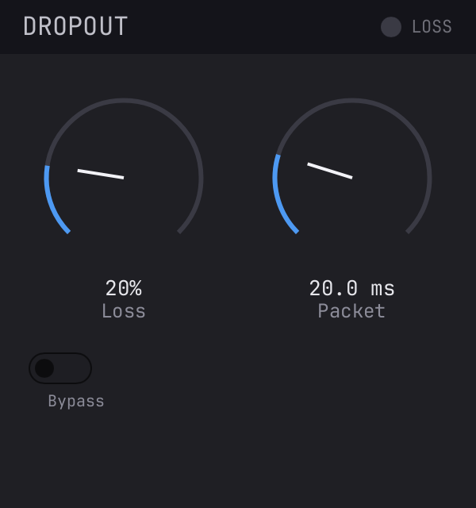

# Dropout Plugin

A real-time VST3 / CLAP / AU audio plugin that simulates **realistic, bursty
packet loss** — live in your DAW. Built with [truce.audio](https://truce.audio) (Rust plugin
framework) and a [Slint](https://slint.dev) GUI.

<p align="center">
  
</p>

## How it works

The incoming audio stream is split into fixed-size packets. At each packet
boundary, the tiny recurrent **LossGen** model (~1.4K params: `dense_in 2→8`,
`GRU 8→8`, `GRU 8→16`, `dense_out 16→1`) emits a drop probability conditioned on
the *previous* decision and the target loss fraction. A seeded PRNG threshold
turns that into a keep/drop choice.

The model's autoregressive conditioning is what makes the loss *bursty* (drops
cluster) instead of independent random.

The model is hand-ported to pure Rust (no ONNX/Torch at runtime); weights are
baked into the binary as `const` arrays. A model step is a few hundred
multiply-adds with no allocation, so it runs directly on the audio thread.

## Controls

| Control | Range | Notes |
|---------|-------|-------|
| **Loss**   | 0–100 % | Target loss fraction, fed to the model as `perc`. |
| **Packet** | 2–80 ms | Packet size = decision granularity. |
| **Bypass** | on/off  | Clean passthrough. |
| LOSS LED   | —       | Lights while a packet is being dropped. |

## Build & run

```bash
# Standalone app (no DAW needed)
cargo truce run

# Build + install into the DAW plug-in folders (CLAP + VST3 by default)
cargo truce install --clap --vst3        # user folders
cargo truce install --au2                # AU (add the feature if needed)

# Tests (model parity, masker behaviour, GUI screenshot)
cargo test

# Re-render the GUI baseline
cargo truce screenshot --out screenshots/default.png
```

## Regenerating model weights

The Rust weights are generated from the PyTorch checkpoint. Re-run after
replacing `lossgen_2000.pth`:

```bash
python3 tools/export_weights.py      # -> src/model/weights.rs
python3 tools/dump_reference.py      # -> src/model/test_vectors.rs (parity test)
cargo test                           # confirm the port still matches PyTorch
```

## CI & releases

GitHub Actions builds on **Linux**, **macOS**, and **Windows**:

- **CI** (`.github/workflows/ci.yml`) — on every push / PR to `main`: runs the
  test suite and a smoke build of the CLAP + VST3 bundles.
- **Release** (`.github/workflows/release.yml`) — on a `v*` tag: builds the
  bundles (CLAP + VST3, plus AU on macOS), zips them per-platform, and opens a
  **draft** GitHub Release with them attached. Cut one with:

  ```bash
  git tag v0.1.0 && git push origin v0.1.0
  ```

Bundles are **unsigned** (no signing identity in CI). On macOS, clear quarantine
after unzipping: `xattr -dr com.apple.quarantine DropoutPlugin.vst3`. To ship
signed/notarized installers, set the `TRUCE_SIGNING_IDENTITY` / `APPLE_ID` /
`TEAM_ID` (and Windows Authenticode) secrets and switch to `cargo truce package`.

## Layout

```
src/lib.rs            Plugin: params, process(), Slint editor wiring
src/model/mod.rs      Pure-Rust LossGen (GRU math)
src/model/weights.rs  @generated const weights
src/dsp.rs            PacketLossMasker + PCG32 PRNG
ui/main.slint         GUI markup
tools/                weight + reference-vector exporters
```
